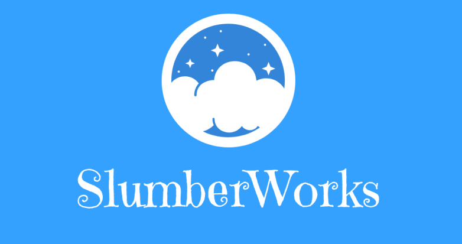

# SlumberWorks



## Table of Contents

- [Introduction](#introduction)
- [Features](#features)
- [Getting Started](#getting-started)
  - [Prerequisites](#prerequisites)
  - [Installation](#installation)
- [Usage](#usage)
- [Technologies Used](#technologies-used)
- [Contributing](#contributing)
- [License](#license)
- [Contact](#contact)

## Introduction

Welcome to the SlumberWorks Idle Game! In this incremental simulation game, players are in charge of managing and expanding their very own dream factory, known as SlumberWorks. The goal is to produce dreams of various kinds, unlock new features, and optimize production lines to build the most prosperous dream factory in the realm of dreams.

## Features

- Build and manage SlumberWorks dream factory
- Produce diverse types of dreams
- Upgrade dream production lines for greater efficiency
- Unlock and utilize boosters to accelerate progress
- Explore different dream worlds and their unique elements
- Achievements and milestones to accomplish
- Save and load game progress for continuity
- Responsive design for seamless gameplay on various devices

## Getting Started

### Prerequisites

To run the SlumberWorks Idle Game on your local machine, ensure you have the following:

- Node.js (version 12 or higher)
- npm (Node Package Manager) or yarn

### Installation

1. Clone the repository to your local machine:

```
git clone https://github.com/Blake14/SlumberWorks
cd SlumberWorks
```

2. Install the necessary dependencies:

```
npm install
```

or

```
yarn install
```

## Usage

To start the development server and run the SlumberWorks Idle Game, use the following command:

```
npm start
```

or

```
yarn start
```

This will launch the application at `http://localhost:3000` in your web browser.

## Technologies Used

The SlumberWorks Idle Game is built using the following technologies:

- ReactJS
- React-Bootstrap
- HTML5
- CSS3
- JavaScript (ES6+)
- LocalStorage (for saving game progress)

## Contributing

Contributions are more than welcome! If you encounter any bugs or have ideas for new features, please open an issue or submit a pull request. Please adhere to the project's code of conduct.

## License

The SlumberWorks Idle Game is an open-source project licensed under the [MIT License](LICENSE).

## Contact

If you have any questions, suggestions, or need any assistance, feel free to contact the project maintainer:

- Name: Blake McPherson
- GitHub: [Your GitHub Profile](https://github.com/Blake14)
- Email: blakemcpherson2@gmail.com

---

Feel free to customize this template further to fit the specifics of your project, and don't forget to replace the placeholders with the appropriate information. Good luck with your SlumberWorks Idle Game!
